# pgsql-erd

[English](README.md) · **Español**

Una herramienta de escritorio de diagramas ER (entidad–relación) y banco de trabajo de bases de datos para
PostgreSQL, hecha con Node.js y Electron. Abre y guarda **archivos `.pgerd` de pgAdmin 4**, así que los
diagramas pueden ir y venir entre la herramienta ERD de pgAdmin y esta aplicación. Además incluye scripts de
TypeScript que conocen el esquema (validadores, generadores de datos de prueba, migraciones) con simulaciones,
un analizador de consultas, un explorador de datos con filtros al estilo de Excel y un asistente de IA que
funciona con Ollama, vLLM, OpenAI y otros servidores compatibles con OpenAI.

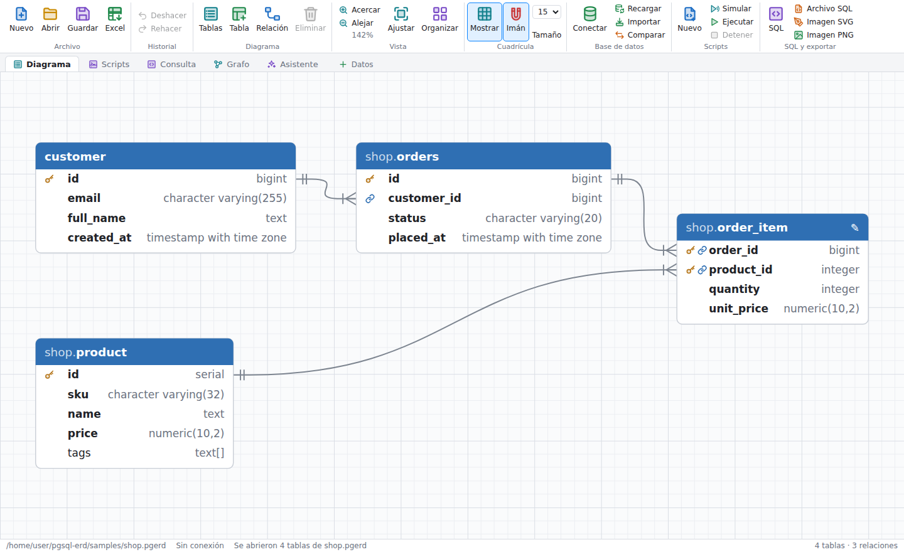

## Capturas de pantalla

**Cinta de opciones y pestañas:** los comandos se agrupan al estilo de Office (Archivo, Historial, Diagrama,
Cuadrícula, Base de datos, Scripts, SQL y exportar) con iconos a dos colores; los menús nativos usan los
mismos iconos. Debajo de la cinta, las pestañas cambian entre **Diagrama**, **Scripts**, **Consulta**,
**Generador**, **Grafo** y **Asistente**, seguidas de una pestaña por cada tabla cuyos datos estés explorando.

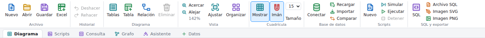

| | |
|---|---|
| **Barra lateral de la tabla:** selecciona una tabla para ver y editar sus propiedades, columnas y relaciones. Al hacer clic en una columna del diagrama se abre su editor. | **Vista previa SQL:** DDL de PostgreSQL en vivo con resaltado de sintaxis. |
| 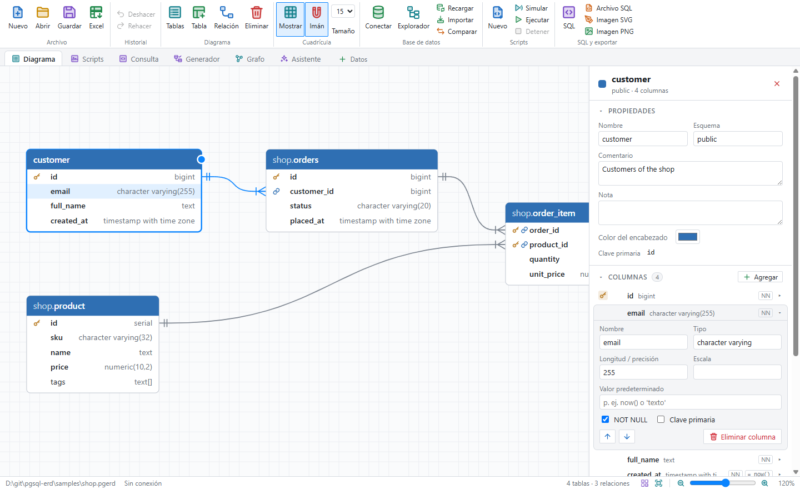 | 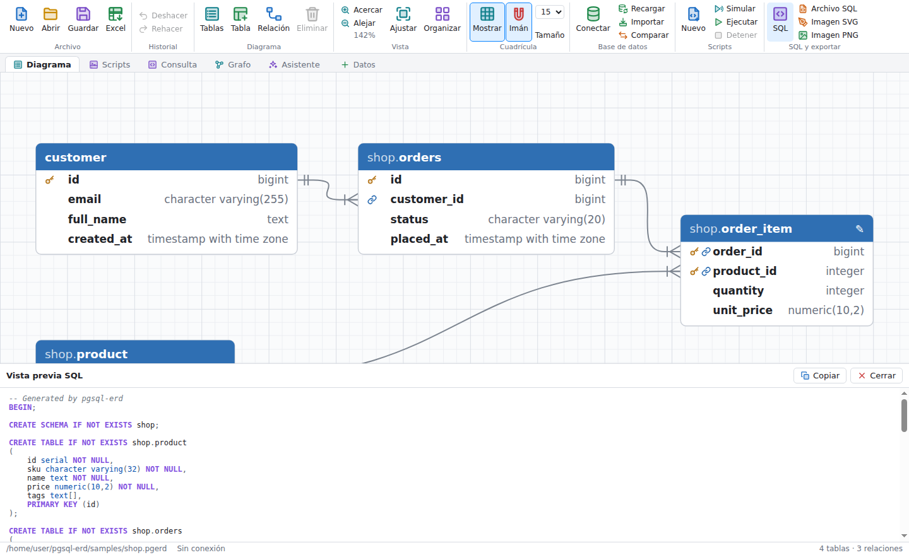 |
| **Relaciones:** agrega una clave foránea y, si quieres, crea también la columna. | **Tema oscuro:** sigue la configuración del sistema. |
| 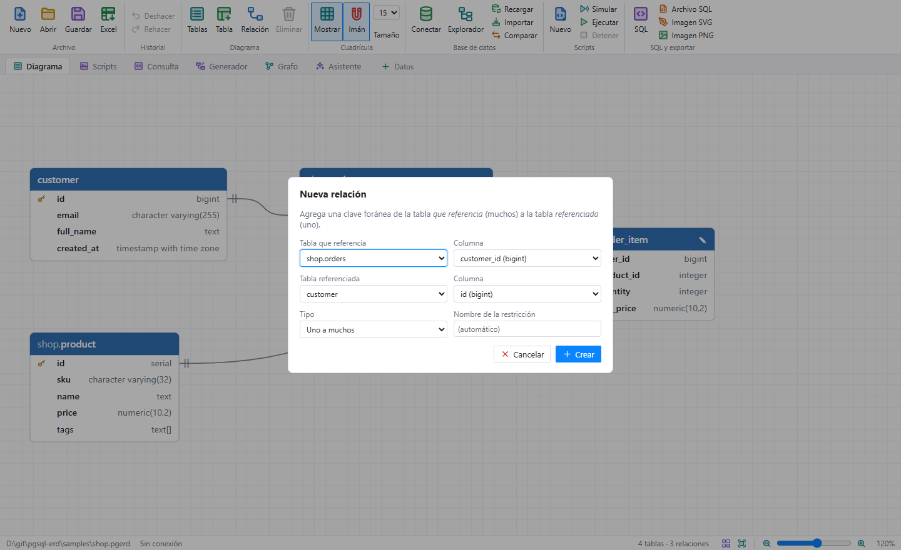 | 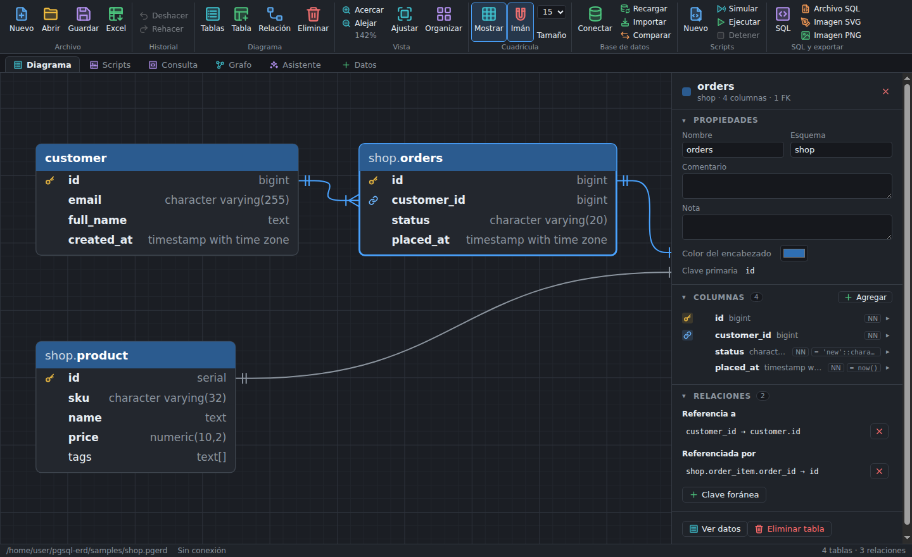 |
| **Importar desde la base de datos:** elige las tablas que quieres agregar o actualiza las que ya están en el diagrama. | **Comparar / sincronizar:** las diferencias con la base de datos y el SQL de migración. |
| 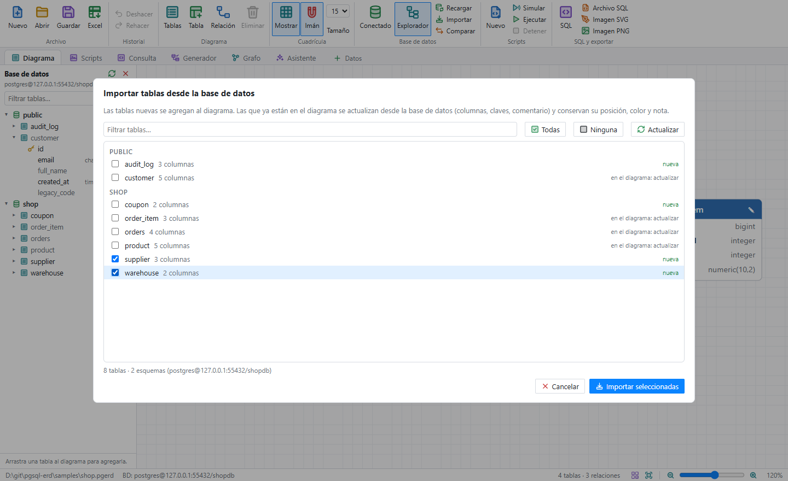 | 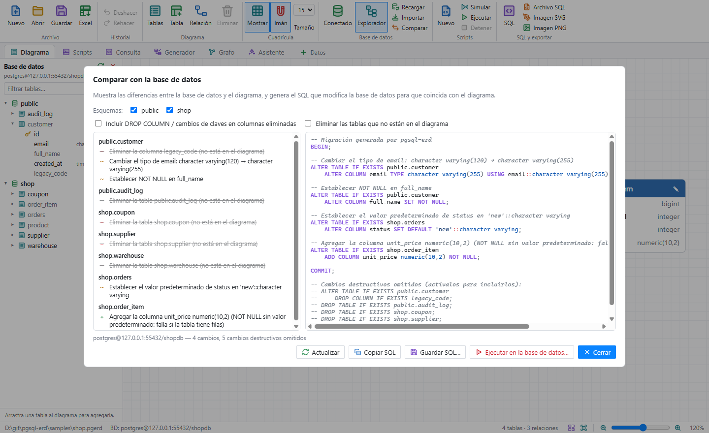 |
| **Scripts:** validadores de TypeScript con tipos; al hacer clic en un error se muestra la fila. | **Revisión antes de confirmar:** los cambios de una ejecución esperan en una transacción abierta hasta que los confirmas. |
| 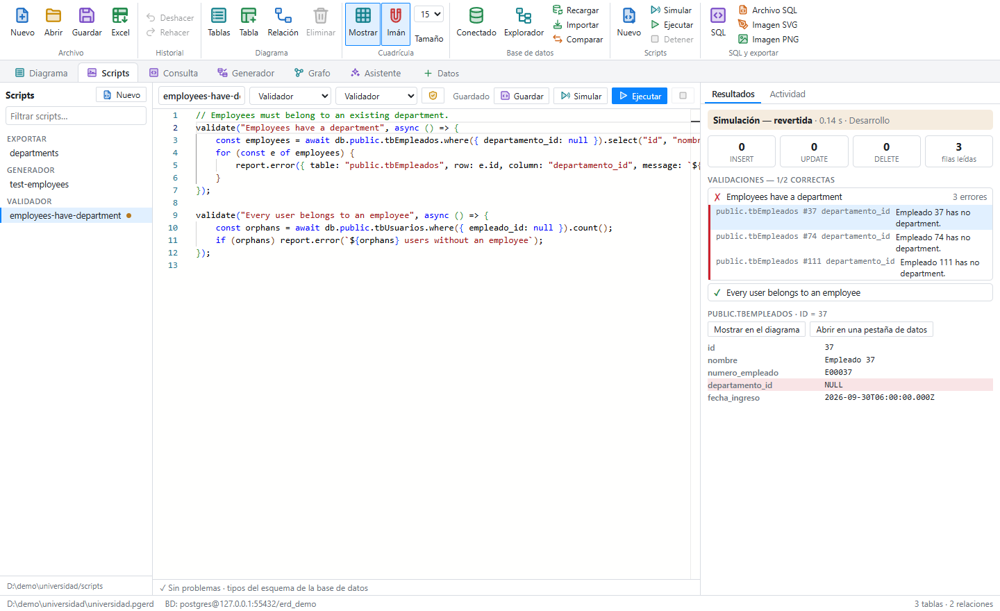 | 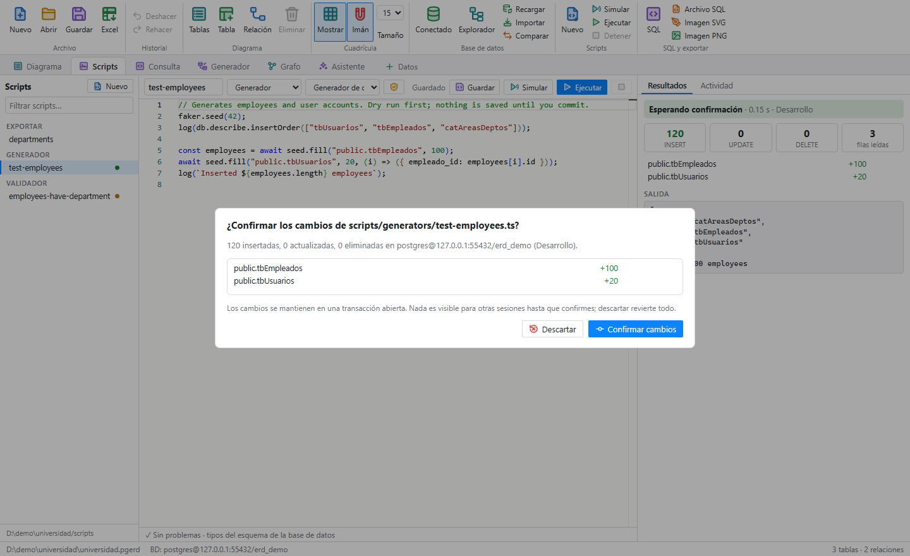 |
| **Analizador de consultas:** EXPLAIN ANALYZE como árbol, con el tiempo de cada nodo y sugerencias de índices. | **Pestañas de datos:** filtros al estilo de Excel con listas de valores, celdas vacías y condiciones. |
| 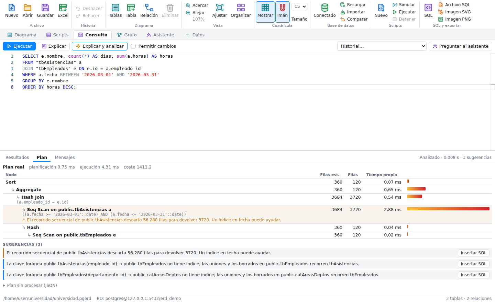 | 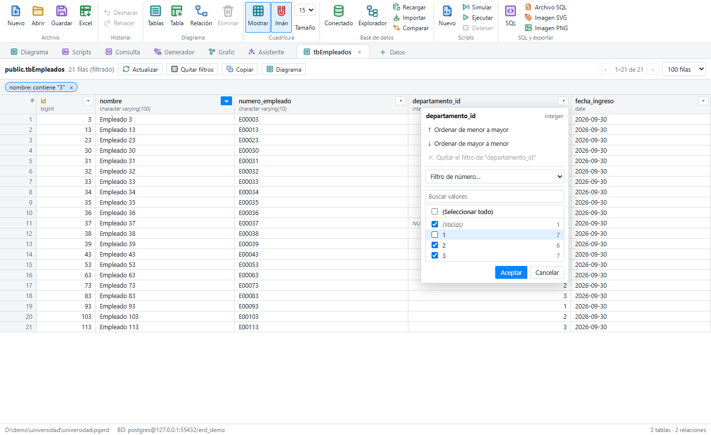 |
| **Asistente:** propone scripts que se abren sin guardar para que los revises; se comprueban contra los tipos del esquema. | **Scripts en el diagrama:** cada script vinculado a las tablas que usa, con su última ejecución. |
| 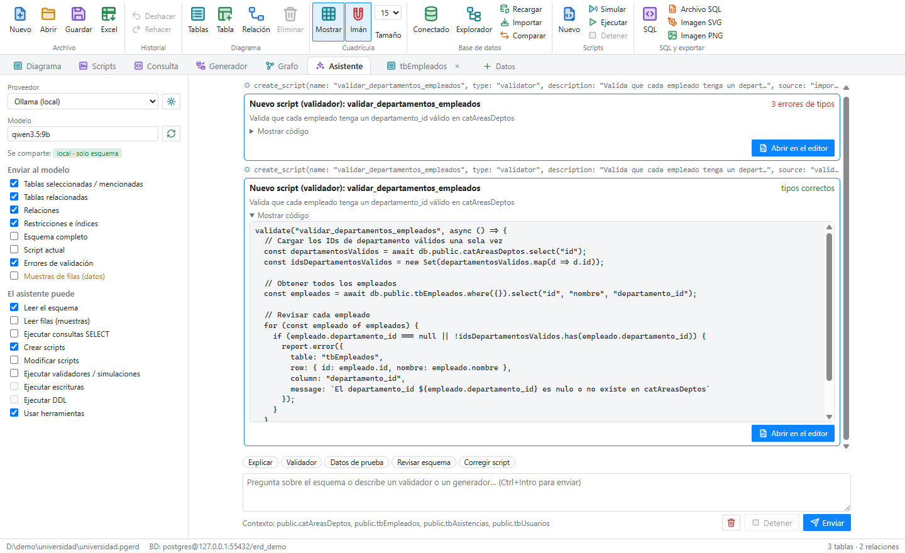 | 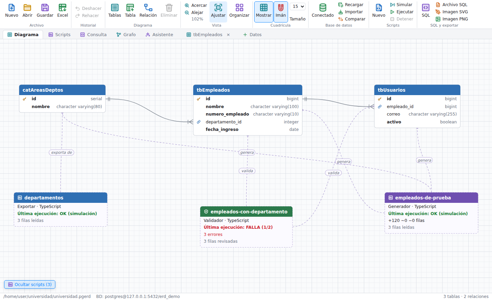 |
| **Columnas de pgvector:** las dimensiones y un índice HNSW listo para copiar para la búsqueda por similitud. | **Consultas de pgvector:** las búsquedas de vecinos más cercanos que recorren todas las filas reciben una sugerencia de índice HNSW. |
| 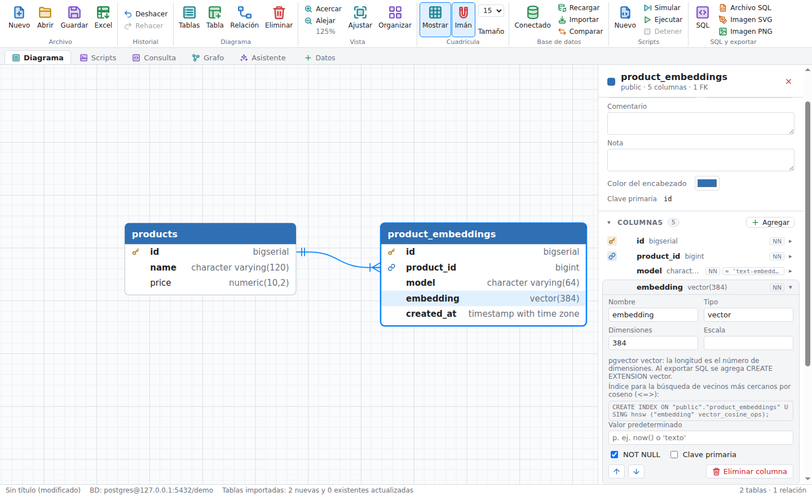 | 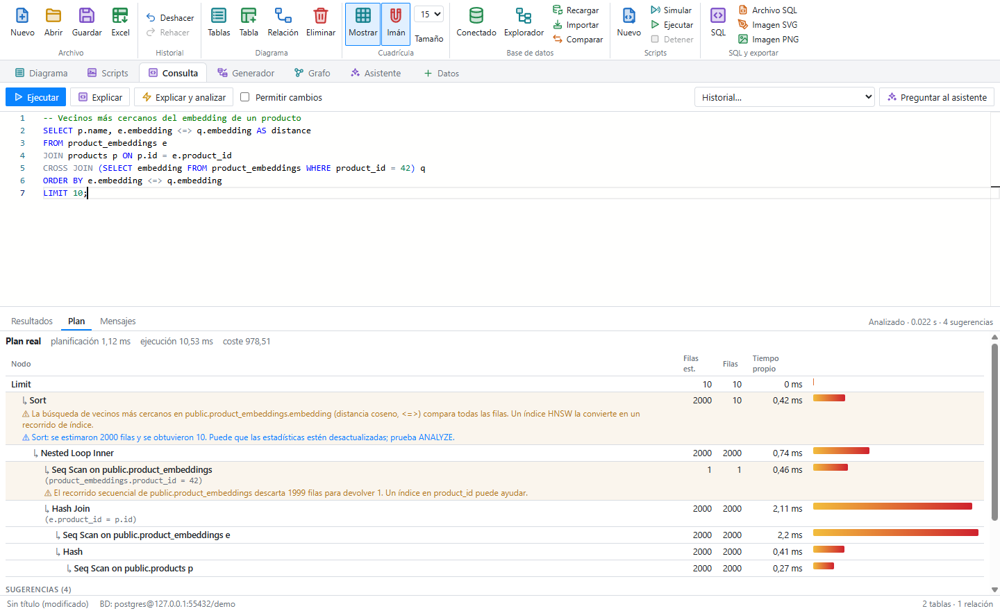 |
| **Relaciones de Apache AGE:** todas las aristas de un grafo, con filtro, búsqueda y edición en el lugar. | **Explorador de grafos:** una vista dirigida por fuerzas; haz doble clic en un vértice para expandir sus vecinos. |
| 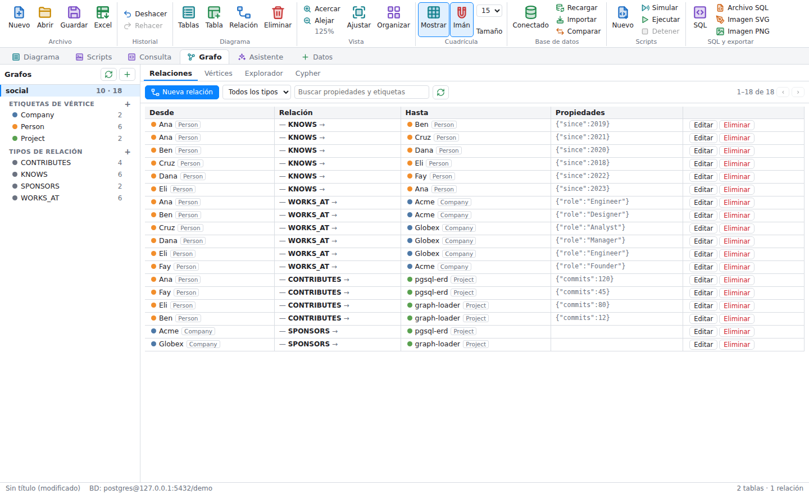 | 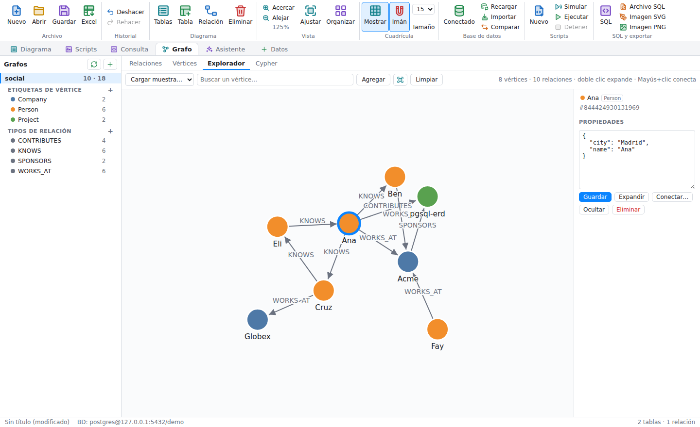 |

## Funciones

- Abre archivos `.pgerd` desde **Archivo → Abrir**, arrastrándolos a la ventana, desde la línea de comandos
  (`npm start -- ruta/al/archivo.pgerd`) o con doble clic una vez instalada la aplicación (la aplicación
  empaquetada registra el tipo de archivo `.pgerd`). Los últimos 10 diagramas abiertos o guardados están en
  **Archivo → Abrir reciente** y en la pantalla de inicio de un diagrama vacío.
- Dibuja tablas con columnas, tipos, claves primarias (icono de llave) y claves foráneas (icono de enlace). Las
  relaciones usan la notación pata de gallo.
- Al seleccionar una tabla se abre una barra lateral. Muestra:
  - el nombre, el esquema y el número de columnas de la tabla
  - sus propiedades (nombre, esquema, comentario, nota, color del encabezado, clave primaria)
  - sus columnas, con iconos de PK/FK e indicadores de NOT NULL y valor predeterminado; haz clic en una para
    editarla
  - sus relaciones, en ambos sentidos

  Haz clic en una columna del diagrama para ir a ella. Arrastra el borde de la barra lateral para cambiar su
  tamaño y pulsa <kbd>Esc</kbd> o × para cerrarla. **Tablas**, en la cinta, muestra una lista filtrable de todas
  las tablas.
- Edición:
  - agregar, renombrar y eliminar tablas
  - editar columnas: nombre, tipo, longitud/escala, NOT NULL, PK, valor predeterminado, orden
  - establecer esquema, comentario, nota y color del encabezado
  - agregar y quitar relaciones, creando opcionalmente la columna FK
- Arrastra las tablas para moverlas. Arrastra el fondo para desplazarte y usa la rueda para acercar o alejar.
  La barra de estado reúne los controles de vista, como en Word: un control deslizante de zoom (100% en el
  centro) con botones para alejar y acercar y el nivel de zoom, además de **Ajustar** y **Organizar** para
  ordenarlo todo.
- Detrás del diagrama se dibuja una cuadrícula (**Mostrar**, <kbd>Ctrl</kbd>+<kbd>Alt</kbd>+<kbd>G</kbd>), con
  una línea más marcada cada cinco celdas. Con **Imán** activado (<kbd>Ctrl</kbd>+<kbd>Mayús</kbd>+<kbd>G</kbd>),
  las tablas arrastradas, los desplazamientos con las flechas, las tablas nuevas y la organización automática
  se ajustan a las líneas de la cuadrícula; mantén <kbd>Alt</kbd> al arrastrar para invertir el ajuste en ese
  movimiento, y <kbd>Mayús</kbd>+flecha mueve de 1 en 1 px. El tamaño de la cuadrícula se elige con
  **Tamaño**, junto al botón Imán, y se guarda en el `gridSize` del archivo.
- Deshacer/rehacer, y un aviso de cambios sin guardar al cerrar la ventana.
- Guarda de nuevo en `.pgerd`. Las propiedades que esta aplicación no edita (tablespace, restricciones check,
  etc.) se conservan tal como estaban.
- Importa tablas desde **Excel (`.xlsx`/`.xlsm`) o CSV** con **Archivo → Importar desde Excel / CSV**
  (<kbd>Ctrl</kbd>+<kbd>Alt</kbd>+<kbd>E</kbd>), el botón **Excel** de la cinta o soltando el archivo en la
  ventana. Cada hoja se lee en uno de dos formatos:
  - **Definiciones de columnas:** una fila de encabezado con *Column* y *Type* (y cualquiera de *Table, Schema,
    Length, Scale, Nullable / Not null, PK, Unique, Default, References, Comment*), una fila por columna. Una
    columna *Table* divide la hoja en varias tablas (una celda vacía continúa la tabla de arriba); *References*
    acepta `tabla.columna`, `esquema.tabla.columna` o `tabla(columna)` y se convierte en una clave foránea. Las
    formas habituales de escribir los tipos (`varchar(50)`, `int`, `decimal(10,2)`, `datetime`, …) se
    convierten a tipos de PostgreSQL. Se reconocen encabezados en inglés y en español.
  - **Datos:** la primera fila da nombre a las columnas y las filas de abajo son datos. Los tipos (integer,
    bigint, numeric, boolean, date, timestamp, time, uuid, jsonb, text) se deducen de los valores, y una
    columna `id` con valores únicos se convierte en la clave primaria.

  El diálogo permite elegir y renombrar las tablas, establecer el esquema y ver el SQL. Los nombres se
  convierten a snake_case salvo que lo desactives. Las tablas que ya están en el diagrama se actualizan y
  conservan su posición. Los archivos `.xls` antiguos no se admiten; guárdalos antes como `.xlsx`.
- Vista previa SQL en vivo con resaltado de sintaxis, y exportación a DDL de PostgreSQL (`CREATE TABLE`, claves
  primarias, restricciones únicas, claves foráneas, comentarios), SVG o PNG.
- Una cinta de opciones al estilo de Office con grupos de comandos con nombre e iconos a dos colores, que
  comparten los menús nativos y los diálogos.
- Temas en **Ver → Tema**: Blanco, Oscuro, Visual Studio (Azul clásico) y Windows ME, o el tema claro u oscuro del
  sistema (predeterminado).
- Disponible en inglés y en español (consulta [Idiomas](#idiomas)).

## Sincronización con la base de datos

El menú **Base de datos** (y los botones *Conectar / Importar / Comparar* de la cinta) trabaja con un servidor
PostgreSQL 10+ en vivo:

- **Conectar:** servidor, puerto, base de datos, usuario, contraseña y modo SSL. Las conexiones se pueden
  guardar como instancias con nombre (con su entorno y su política) y elegir de una lista; doble clic en una
  para conectar. Marca **Recordar la contraseña** para guardarla cifrada con el almacén de credenciales del
  sistema operativo (DPAPI, Llavero, libsecret/kwallet); sin almacén de credenciales se conserva en memoria
  hasta que se cierra la aplicación. Una contraseña guardada solo se envía al servidor, puerto y usuario para
  los que se guardó. **Reconectar a la última instancia** reabre la última sesión al abrir una ventana.
  Conectarse a otra base de datos pide confirmación primero: cierra el diagrama (descartando los cambios sin
  guardar), las pestañas de datos y el generador de consultas, y borra los resultados de la consulta.
- **Importar tablas:** lista todas las tablas de la base de datos por esquema, con su número de columnas e
  indicando si ya están en el diagrama. Las tablas seleccionadas que son nuevas se agregan al diagrama con sus
  columnas, claves primarias, restricciones únicas y claves foráneas. Las que ya están en el diagrama se
  actualizan desde la base de datos; se conservan su posición, color y nota. Las columnas serial vuelven como
  `serial`/`bigserial`.
- **Explorador:** un panel a la izquierda del diagrama con un árbol de los esquemas, tablas y columnas de la
  base de datos conectada. Arrastra una tabla al diagrama (o haz doble clic) para agregarla donde la sueltes;
  sus claves foráneas hacia y desde tablas que ya están en el diagrama se dibujan como relaciones. Las tablas
  que ya están en el diagrama aparecen marcadas. Muestra u oculta el panel con **Explorador** en el grupo
  Base de datos. El mismo panel acompaña al generador de consultas en la pestaña **Generador**.
- **Comparar / sincronizar:** compara el diagrama con la base de datos (por esquema) y lista todas las
  diferencias:
  - tablas y columnas nuevas y eliminadas
  - cambios de tipo, `NOT NULL`, valor predeterminado e identidad
  - claves primarias, restricciones únicas y claves foráneas (incluidos los cambios de `ON DELETE`/`ON UPDATE`)
  - comentarios de las tablas

  Después genera el SQL de migración que hace que la base de datos coincida con el diagrama. Puedes copiarlo o
  guardarlo, o ejecutarlo en la base de datos en una sola transacción; si alguna sentencia falla, no se aplica
  nada.
  - Las sentencias se ordenan para que funcionen: las claves foráneas dependientes se eliminan antes que la
    clave a la que hacen referencia y se vuelven a crear después.
  - Las sentencias destructivas (`DROP COLUMN`, `DROP TABLE`) solo se incluyen si marcas la opción
    correspondiente. Si no, aparecen como comentarios al final del script.
  - No se pueden detectar tablas o columnas renombradas: aparecen como una eliminación más una adición.

## pgvector

Las columnas de [pgvector](https://github.com/pgvector/pgvector) (`vector`, `halfvec`, `sparsevec`) se
admiten en toda la aplicación:

- **Diagrama:** los tipos están en la lista de tipos de columna, y su longitud es el número de dimensiones
  (`vector(1536)`). El editor de columnas muestra el índice HNSW para la búsqueda por coseno, listo para
  copiar. Los vectores de más de 2000 dimensiones reciben un índice de expresión `halfvec`, que funciona hasta
  4000.
- **Exportación SQL y migraciones** agregan `CREATE EXTENSION IF NOT EXISTS vector;` cuando el diagrama usa
  tipos vector. Comparar / sincronizar solo lo agrega si la base de datos todavía no tiene la extensión.
- **Scripts:** los valores `vector` y `halfvec` se leen como `number[]` y se pueden escribir como `number[]`,
  `Float32Array` o texto de pgvector (`'[1,2,3]'`). Los valores `sparsevec` son cadenas (`'{1:0.5,3:1}/5'`) y
  se pueden escribir como arreglos densos. `where({ embedding: [1, 2, 3] })` compara con un vector.
  `seed.row()` / `seed.fill()` generan vectores unitarios aleatorios, y `seed.check()` comprueba las
  dimensiones.
- **Analizador de consultas:** una búsqueda de vecinos más cercanos (`ORDER BY embedding <=> $1 LIMIT n`) que
  ordena todas las filas recibe una sugerencia de índice HNSW con la clase de operador de su operador (`<->`,
  `<=>`, `<#>`, `<+>`). También señala un índice vectorial existente creado para otro operador.
- **Pestañas de datos:** muestran los vectores largos abreviados como `[0.1,0.2,…] (1536 dim.)`; pasa el
  puntero sobre una celda para ver el valor completo.

## Grafos de Apache AGE

La pestaña **Grafo** (Base de datos → Grafos, <kbd>Ctrl</kbd>+<kbd>Alt</kbd>+<kbd>H</kbd>) gestiona los grafos
de propiedades de [Apache AGE](https://age.apache.org) de la base de datos conectada:

- **Barra lateral:** los grafos de la base de datos con sus etiquetas de vértice y tipos de relación, y cuántos
  vértices o relaciones tiene cada uno. Aquí puedes crear y eliminar grafos y etiquetas. Si el servidor tiene
  AGE disponible pero la base de datos todavía no lo usa, **Instalar AGE** ejecuta `CREATE EXTENSION age`.
- **Relaciones:** todas las relaciones, mostradas como *origen — TIPO → destino*. Puedes filtrar por tipo,
  buscar en las propiedades y etiquetas de la relación y de ambos vértices, y recorrer la lista por páginas.
  **Nueva relación** elige los dos vértices buscándolos mientras escribes y establece el tipo (un tipo nuevo se
  crea automáticamente) y las propiedades en JSON. Cada fila se puede editar en el lugar o eliminar.
- **Vértices:** los vértices con su número de relaciones. Puedes crearlos, editarlos y eliminarlos (al
  eliminar uno también se eliminan sus relaciones). **Conectar** inicia una relación desde ese vértice, y al
  hacer clic en el número se listan las relaciones de ese vértice.
- **Explorador:** una vista dirigida por fuerzas. Carga una muestra del grafo o busca un vértice; después haz
  doble clic en un vértice para expandir sus vecinos y arrastra, desplaza y acerca según necesites. Selecciona
  un vértice o una relación para editar sus propiedades. Para conectar dos vértices, usa **Conectar…** y haz
  clic en el destino, o haz Mayús+clic en él.
- **Cypher:** ejecuta consultas Cypher en el grafo seleccionado. Las columnas del resultado salen de la
  cláusula `RETURN`, o puedes indicarlas para `RETURN *`. Los vértices, aristas y caminos se muestran de forma
  legible y se pueden abrir en el explorador.

Los cambios se confirman de inmediato, necesitan una conexión cuya política permita escrituras (los grafos y
las etiquetas también necesitan cambios de esquema) y quedan registrados en el registro de auditoría. Las
eliminaciones piden confirmación. Las consultas Cypher que modifican el grafo (`CREATE`, `MERGE`, `SET`,
`DELETE`, `REMOVE`) solo se ejecutan si marcas **Permitir cambios**; las demás se ejecutan en una transacción
de solo lectura. Los ids de los elementos del grafo son de 64 bits, así que se guardan como cadenas y nunca se
redondean. Los esquemas propios de AGE (`ag_catalog` y uno por grafo) se dejan fuera de **Importar** y
**Comparar**.

La sesión ejecuta `LOAD 'age'`, o `$libdir/plugins/age` para usuarios que no son superusuarios, salvo que AGE
ya esté en `shared_preload_libraries`.

## Pestañas del banco de trabajo

### Scripts

Los scripts son archivos de TypeScript que se guardan junto al diagrama, en `scripts/<tipo>/` (validadores,
generadores, cargas de datos, migraciones, consultas, mantenimiento, importaciones, exportaciones), para que
puedan estar en el control de versiones. La primera línea guarda sus metadatos
(`// @pgsql-erd {"type":"validator"}`).

- **Editor Monaco con IntelliSense para tu base de datos.** Los tipos se generan a partir de la base de datos
  conectada (o del diagrama sin conexión): cada tabla recibe una interfaz de fila y otra de inserción, y
  `db.public.tbUsuarios.insert({ nombre: 123 })` se marca con *Type 'number' is not assignable to type
  'string'*. También se señalan los nombres de tabla desconocidos en `db.table("…")`. Los tipos también se
  escriben en `generated/database.d.ts` para otros editores y se actualizan con **Base de datos → Actualizar
  esquema**.
- **API de scripts** (globales, sin imports):
  - `db.public.orders.where({ status: ["new", "paid"], total: { gt: 10 } }).orderBy("id").limit(50).select()`,
    `.first()`, `.count()`, `.insert(row)`, `.insertMany(rows)`, `.update(values)`, `.delete()`
  - `db.query(sql, params)`, `db.transaction(async (tx) => …)` (un savepoint),
    `db.describe.table() / relationships() / insertOrder()`, `db.preview()`
  - `validate(nombre, async () => { report.error({ table, row, column, message }) })`, `report.warning/info`,
    `log()`
  - `faker` (datos ficticios con semilla), `seed.row(tabla)`, `seed.fill(tabla, n)` (valores verosímiles,
    claves foráneas válidas, valores únicos que no chocan con las filas existentes), `seed.check(tabla, fila)`
  - `ai.chat(prompt)`, `ai.structured({ table | schema, prompt })` (JSON validado, ver abajo), para generar
    datos o revisarlos (p. ej. un validador que pide al modelo señalar valores sospechosos). Usa el proveedor
    y el modelo elegidos en la pestaña Asistente; con un proveedor remoto se pide confirmación antes de la
    primera ejecución que llame a `ai.*`, porque el script puede enviarle filas.
- **Simular** (F6) ejecuta el script en una transacción que siempre se revierte e informa de las inserciones,
  actualizaciones, eliminaciones y filas leídas por tabla. **Ejecutar** (F5) mantiene la transacción abierta si
  el script modificó datos y te pide confirmar o descartar (se revierte automáticamente a los 10 minutos).
- **Permisos** por script, a partir de perfiles (Solo lectura, Validador, Generador de datos, Carga de datos,
  Migración, Acceso completo) más ajustes individuales: leer filas, SELECT directo, INSERT, UPDATE, DELETE, DDL,
  escrituras con SQL directo, IA. Los scripts sin permisos de escritura se ejecutan en una transacción
  `READ ONLY`, así que PostgreSQL también lo impone. Todos los perfiles salvo Migración permiten la IA.
- **Validadores:** listan cada `validate()` como correcto o fallido; al hacer clic en un error se muestra la
  fila afectada, la validación en el editor y enlaces a la tabla en el diagrama y en una pestaña de datos.

### Scripts en el diagrama

**Mostrar scripts** (abajo a la izquierda del diagrama, o **Ver → Mostrar scripts en el diagrama**) dibuja los
scripts guardados del proyecto como entidades junto a las tablas que usan. Un script se vincula a las tablas que
nombra en su código o que aparecen en sus metadatos, con una línea discontinua etiquetada según lo que hace:
*valida*, *genera*, *carga*, *migra*, *importa a*, *exporta de*, *consulta*. Cada recuadro muestra el tipo del
script y su última ejecución en esta máquina: OK o FALLA con el número de validaciones, filas modificadas y
filas revisadas.

- Arrastra los recuadros para colocarlos; sus posiciones se guardan en `pgsql-erd.json`, no en el archivo
  `.pgerd`, así que el diagrama sigue siendo compatible con pgAdmin. Las imágenes SVG y PNG exportadas incluyen
  los scripts mientras se muestran.
- Haz clic en un recuadro para ver sus detalles y las tablas vinculadas, con **Abrir script** y
  **Ejecutar validador** / **Simular**; con doble clic se abre en la pestaña Scripts.
- La barra lateral de una tabla lista los scripts que la usan, con su último resultado.
- Los scripts están ocultos de forma predeterminada, para que los diagramas grandes sigan siendo legibles.

### Consulta

Un editor SQL con autocompletado de tablas y columnas. **Ejecutar** (Ctrl+Intro) ejecuta la selección o todo
en una transacción de solo lectura; las sentencias que modifican datos o el esquema necesitan **Permitir
cambios**, una confirmación y una conexión que permita escrituras, y se confirman juntas. **Explicar** muestra
el plan estimado y **Explicar y analizar** (Ctrl+Mayús+Intro) el real (siempre se revierte), como un árbol con
filas, tiempo propio y una barra por nodo. Las sugerencias señalan recorridos secuenciales que descartan la
mayoría de las filas, estimaciones de filas erróneas, ordenaciones y hashes que se vuelcan a disco y claves
foráneas sin índice, con la sentencia `CREATE INDEX` / `ANALYZE` lista para insertar. **Preguntar al
asistente** envía la consulta, su plan y las sugerencias a la pestaña Asistente.

### Generador

Un generador visual de consultas (Base de datos → Generador de consultas, Ctrl+Alt+U). Arrastra tablas desde el
explorador de la base de datos al lienzo (o haz doble clic) y marca las columnas que quieres obtener; la casilla
del encabezado marca todas. Las tablas con una clave foránea entre ellas se unen automáticamente por sus columnas:

- una tabla agregada dos veces recibe su propio alias y la siguiente clave foránea: una segunda tabla
  `addresses` junto a `orders` se une por la dirección de envío cuando la primera tomó la de facturación
- una tabla que se referencia a sí misma (`employees.manager_id`) se puede agregar dos veces para unirla
  consigo misma
- arrastra una columna sobre la columna de otra tabla para unirlas a mano

Cada unión tiene un pequeño menú sobre su línea: solo las filas que coinciden (`JOIN`), todas las filas de una
tabla (`LEFT` / `RIGHT JOIN`) o de ambas (`FULL JOIN`). Los alias se pueden cambiar en los encabezados de las
tablas; **Sin duplicados** y **Límite** completan la sentencia. El SQL aparece debajo del lienzo mientras
trabajas: **Abrir en Consulta** lo pone en la pestaña Consulta y **Ejecutar** además lo ejecuta ahí. La
consulta se recuerda entre sesiones.

### Pestañas de datos

**Datos**, en la barra de pestañas (o **Ver datos** en la barra lateral de una tabla, o **Base de datos →
Explorar datos de una tabla…**), abre una tabla en su propia pestaña: una cuadrícula de solo lectura con
paginación (100/500/1000 filas), encabezados fijos y **Copiar** (separado por tabulaciones, se pega en una hoja
de cálculo). Cada encabezado de columna tiene un menú de filtro al estilo de Excel:

- ordenar de forma ascendente / descendente (según el tipo de la columna: los números y las fechas se ordenan
  como tales)
- una lista de los valores distintos de la columna con su recuento, **(Vacías)**, **(Seleccionar todo)** y un
  cuadro de búsqueda; como en Excel, la lista tiene en cuenta los filtros de las demás columnas
- filtros de texto (contiene, comienza por, es igual a, está vacío, …) o de número / fecha (mayor que,
  entre, …)

Los filtros activos se muestran como etiquetas encima de la cuadrícula.

### Asistente

Conversa con un modelo sobre el esquema y deja que escriba scripts. Ve las tablas seleccionadas en el diagrama
o nombradas en la pregunta, sus tablas relacionadas, relaciones y restricciones, el script actual y los últimos
errores de validación; cada uno se puede desactivar. Con las herramientas activadas puede consultar tablas,
comprobar un script contra los tipos, validar SQL y proponer scripts nuevos o cambios; las propuestas se abren
**sin guardar** en el editor, indicando si pasan la comprobación de tipos. Nada de lo que escribe el asistente
se ejecuta por sí solo.

- **Proveedores:** Ollama, vLLM / LM Studio / llama.cpp / cualquier servidor compatible con OpenAI, y OpenAI.
  Se configuran en **Proveedores de IA**; la lista de modelos viene del servidor. Las claves de API se guardan
  cifradas con el almacén de credenciales del sistema operativo (`safeStorage` de Electron: Keychain, DPAPI,
  libsecret) y nunca llegan a la ventana; sin almacén de credenciales solo se guardan en memoria. Si está
  definida, se usa `OPENAI_API_KEY`.
- **Permisos** (guardados en el proyecto): leer el esquema, leer filas, ejecutar SELECT, crear/modificar
  scripts, ejecutar validadores y simulaciones. Las escrituras y el DDL nunca están disponibles para el
  asistente.
- **Los datos de filas** solo se envían si se permite (muestras, resultados de consultas, salida de
  validadores); con proveedores remotos lo confirmas antes, y el panel muestra si la conversación es de *solo
  esquema* o incluye datos.
- **Salida estructurada** (`ai.structured`) pide JSON que cumpla un JSON Schema (para una tabla, derivado de
  sus columnas insertables) y después comprueba el análisis del JSON, el esquema, los tipos de columna, NOT NULL
  y las longitudes, y devuelve los errores al modelo para que lo reintente. Al script solo le llegan valores
  válidos.

## Modelo de seguridad

- La página (renderer) nunca ejecuta scripts ni ve credenciales: la contraseña de la base de datos se envía
  una vez al conectar y se queda en el proceso principal; lo mismo con las claves de API. Las contraseñas
  guardadas se cifran con el almacén de credenciales del sistema operativo y nunca se devuelven a la página.
- Los scripts se ejecutan en un proceso aparte (el Node de Electron) con un entorno vacío, un límite de
  memoria, un tiempo máximo y el modelo de permisos de Node: sin escritura de archivos, sin lecturas fuera de
  la aplicación y sin procesos hijos. El proceso no tiene conexión a la base de datos; cada llamada `db.*` va al
  proceso principal, que comprueba los permisos del script y la política de la conexión.
- Las conexiones tienen un entorno (desarrollo, pruebas, preproducción, producción) y una política: producción
  es de solo lectura de forma predeterminada, se muestra en rojo y bloquea el DDL, incluidas las migraciones
  del diálogo de comparación.
- Las escrituras se revisan antes de confirmarse; `BEGIN`/`COMMIT` dentro de los scripts se rechazan.
- Un registro de auditoría (**Base de datos → Abrir registro de auditoría**, y la pestaña Actividad) guarda las
  conexiones, las actualizaciones de esquema y las migraciones, las ejecuciones y confirmaciones de scripts, las
  escrituras de la pestaña Consulta, las peticiones al asistente (y si llevaban datos de filas) y los cambios de
  configuración.

## Idiomas

La aplicación está disponible en **inglés** (English) y **español**. Sigue el idioma del sistema operativo y,
si no lo tiene, usa el inglés. Para elegir uno tú mismo, usa **Ver → Idioma**; los menús cambian de inmediato
y las ventanas abiertas cambian cuando se reinicia la aplicación (ofrece reiniciarla). La elección se guarda en
`settings.json`, en la carpeta de datos de usuario de la aplicación. Los números y las fechas siguen el idioma
elegido.

Las traducciones cubren toda la interfaz: menús, diálogos, la barra lateral del diagrama, todas las pestañas,
los resúmenes de comparación / migración y las sugerencias del plan de consulta. Los mensajes que vienen del
propio PostgreSQL y los nombres de los nodos del plan (`Seq Scan`, `Hash Join`) se quedan como los informa el
servidor.

### Agregar un idioma

El texto en inglés es la clave: el código llama a `tr('Save')` o a `trn(n, '{n} table', '{n} tables')`
(`src/shared/i18n.js`), y la página estática se traduce a partir de su texto al cargarse. Para agregar un
idioma:

1. Copia `src/shared/locales/es.js` en `src/shared/locales/<código>.js` y traduce los valores. Conserva los
   `{marcadores}` y los espacios al principio o al final.
2. Impórtalo en `src/shared/i18n.js` y agrégalo a `CATALOGS` y a `LOCALES` (el nombre que se muestra en
   Ver → Idioma, en su propio idioma).
3. Agrégalo a `CATALOGS` en `tests/i18n.test.js` y ejecuta `npm test`. La prueba lista cada texto usado en el
   código o en la página que falta en el catálogo, las entradas que ya no se usan y las traducciones cuyos
   marcadores no coinciden.

El texto nuevo de la interfaz pasa por `tr()` / `trn()` de la misma manera; la prueba falla hasta que cada
catálogo lo tenga.

## Primeros pasos

```bash
npm install
npm start                          # diagrama vacío
npm start -- samples/shop.pgerd    # abrir un archivo
npm test                           # pruebas unitarias
# pruebas de integración contra un servidor real (crea y elimina bases de datos temporales):
PGERD_TEST_HOST=127.0.0.1 PGERD_TEST_PORT=5432 PGERD_TEST_USER=postgres PGERD_TEST_PASSWORD=… npm test
```

Los iconos están en `src/renderer/icons.js`. Después de cambiarlos, ejecuta `npm run menu-icons` para volver a
generar los iconos PNG de los menús nativos en `src/main/menu-icons/`.

Para crear instaladores (AppImage/deb, NSIS, dmg) con la asociación de archivos `.pgerd`:

```bash
npm run dist
```

### Windows (.exe)

En Windows, con Node.js 20+ instalado, ejecuta desde la raíz del repositorio:

```bat
scripts\build-windows.bat
```

Es un archivo por lotes normal, así que se ejecuta desde el Símbolo del sistema o con doble clic, sin cambiar
la directiva de ejecución de PowerShell.

Instala las dependencias, ejecuta las pruebas y escribe en `dist\`:

| Archivo | Qué es |
| --- | --- |
| `pgsql-erd-Setup-<versión>.exe` | Instalador: permite elegir la carpeta de instalación, agrega accesos directos al menú Inicio y al escritorio y registra los archivos `.pgerd` |
| `pgsql-erd-<versión>-portable.exe` | Un solo ejecutable que funciona sin instalar |
| `win-unpacked\pgsql-erd.exe` | La aplicación sin empaquetar a partir de la que se crean los otros dos |

Para crear solo uno, pasa `installer`, `portable` o `dir` (por defecto `all`), p. ej.
`scripts\build-windows.bat portable`. Opciones: `--skip-tests`, `--skip-install`, `--clean` (elimina antes
`dist\`). Las mismas compilaciones están disponibles como scripts de npm: `npm run dist:win` (instalador +
portable), `dist:win:installer`, `dist:win:portable` y `dist:win:dir`.

La aplicación, el instalador y el desinstalador usan `build/icon.ico`. Los ejecutables no están firmados, así
que Windows SmartScreen avisa la primera vez que se ejecutan. Crearlos en Linux o macOS también funciona, pero
necesita [Wine](https://www.winehq.org/) (con soporte de 32 bits para el instalador).

## Estructura del proyecto

```
src/main/main.cjs         proceso principal de Electron: ventanas, menús, diálogos de archivos, E/S de archivos
src/main/db.cjs           conexión a PostgreSQL, introspección del catálogo, ejecución de migraciones (pg)
src/main/preload.cjs      API de contextBridge expuesta al renderer (window.erdHost)
src/main/ipc/             IPC para conexiones, scripts, consultas, pestañas de datos, el asistente, la auditoría
src/main/database/        conexiones y políticas por ventana, ejecución de la pestaña Consulta, consultas del
                          explorador de datos, grafos de Apache AGE (age.cjs)
src/main/scripting/       comprobación de tipos y transpilación (TypeScript), ejecución de scripts, la API de
                          base de datos de los scripts
src/main/ai/              proveedores (Ollama, compatibles con OpenAI, OpenAI), claves, herramientas, salida
                          estructurada
src/main/projects/        scripts y configuración en la carpeta del proyecto
src/runner/               el proceso aislado de los scripts
src/shared/               modelo del esquema, generador de tipos, permisos, constructor de contexto, esquema
                          JSON, datos ficticios, analizador de planes, utilidades de pgvector y Apache AGE
                          (usados por el proceso principal, el runner y la página)
src/shared/i18n.js        traducciones: tr(), trn(), selección del idioma
src/shared/locales/       catálogos de traducción (es.js)
src/renderer/index.html   estructura de la interfaz
src/renderer/app.js       dibujo, interacción, panel de propiedades, comandos
src/renderer/dbui.js      diálogos de conexión / importación / comparación
src/renderer/tabs.js      pestañas principales
src/renderer/workbench.js pestaña Scripts
src/renderer/query.js     pestaña Consulta
src/renderer/querybuilder.js pestaña Generador (generador visual de consultas)
src/renderer/dbtree.js    explorador de la base de datos
src/renderer/graph.js     pestaña Grafo (Apache AGE)
src/renderer/databrowser.js pestañas de datos y filtros
src/renderer/assistant.js pestaña Asistente y configuración de los proveedores de IA
src/renderer/xlui.js      diálogo de importación de Excel / CSV
src/renderer/lib/pgerd.js lectura y escritura de .pgerd
src/renderer/lib/sql.js   generación de DDL de PostgreSQL
src/renderer/lib/layout.js geometría de las tablas, trazado de relaciones, organización automática
src/renderer/lib/catalog.js filas del catálogo -> modelo del diagrama
src/renderer/lib/diff.js  comparación entre base de datos y diagrama, y SQL de migración
src/renderer/lib/sync.js  importar / actualizar tablas del diagrama desde la base de datos
src/renderer/lib/spreadsheet.js lectura de .xlsx / CSV y conversión de hoja -> tabla
src/renderer/lib/highlight.js resaltado de sintaxis SQL
src/renderer/lib/querybuilder.js uniones y SELECT del generador de consultas
samples/shop.pgerd        diagrama de ejemplo
build/icon.svg            origen del icono de la aplicación; icon.ico (Windows) e icon.png se generan a partir de él
scripts/build-windows.bat script de compilación para Windows
tests/                    suites de node:test
```

El renderer se ejecuta en un sandbox con aislamiento de contexto y sin integración de Node. Todo el acceso a
archivos pasa por el puente de preload.

Una carpeta de proyecto tiene este aspecto; todo es texto plano y no se guarda ninguna contraseña ni clave de
API:

```
proyecto/
├── diagram.pgerd
├── pgsql-erd.json            configuración del proyecto (proveedor del asistente, modelo, permisos)
├── scripts/
│   ├── validators/*.ts
│   ├── generators/*.ts
│   └── migrations/*.ts
└── generated/database.d.ts   tipos para otros editores
```

## El formato .pgerd

Un archivo `.pgerd` es el modelo serializado de react-diagrams de pgAdmin:

```json
{
  "version": 80900,
  "data": {
    "offsetX": 0, "offsetY": 0, "zoom": 100, "gridSize": 15,
    "layers": [
      { "type": "diagram-links", "models": { "<link id>": { "data": {
          "local_table_uuid": "…", "local_column_attnum": 1,
          "referenced_table_uuid": "…", "referenced_column_attnum": 0 } } } },
      { "type": "diagram-nodes", "models": { "<table id>": {
          "type": "table", "x": 40, "y": 40,
          "otherInfo": { "note": "", "data": {
            "name": "orders", "schema": "public",
            "columns": [{ "name": "id", "cltype": "bigint", "attnum": 0, "is_primary_key": true }],
            "primary_key": [{ "columns": [{ "column": "id" }] }],
            "foreign_key": [{ "name": "…", "columns": [{ "local_column": "customer_id",
              "references": "<table id>", "referenced": "id" }] }] } } } } }
    ]
  }
}
```

La aplicación lee las relaciones de la lista `foreign_key` de cada tabla y de la capa de enlaces. Al guardar,
reconstruye ambas, junto con los puertos que pgAdmin usa para unir los enlaces a las columnas.

## Licencia

[MIT](LICENSE)
