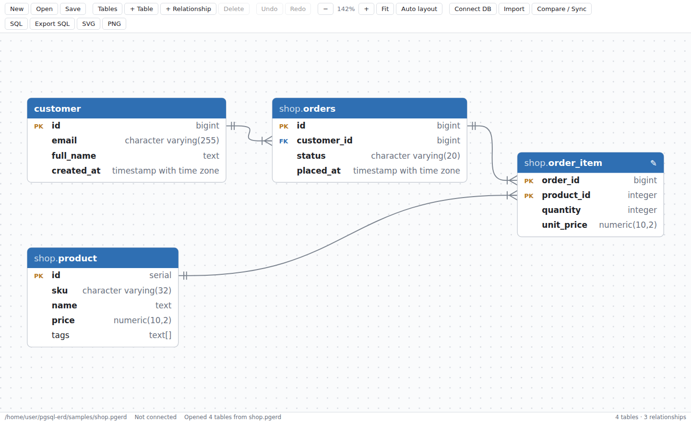
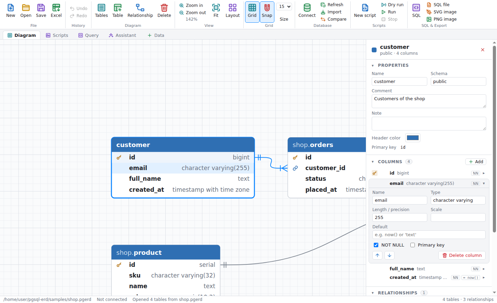
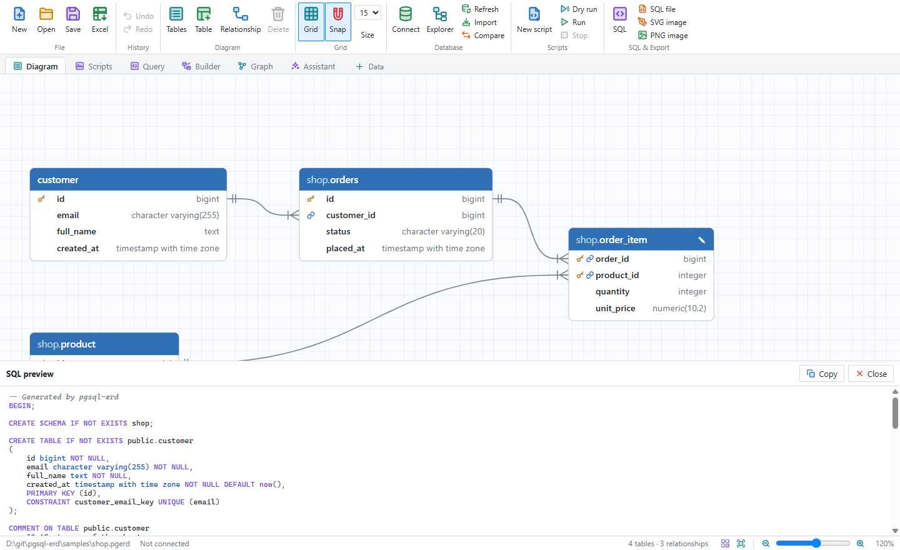
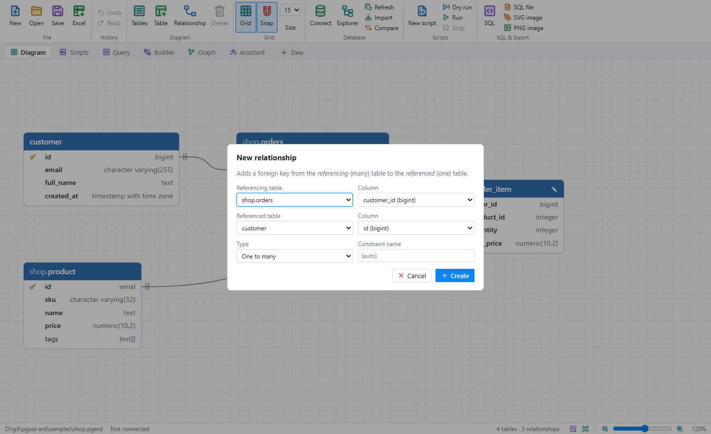
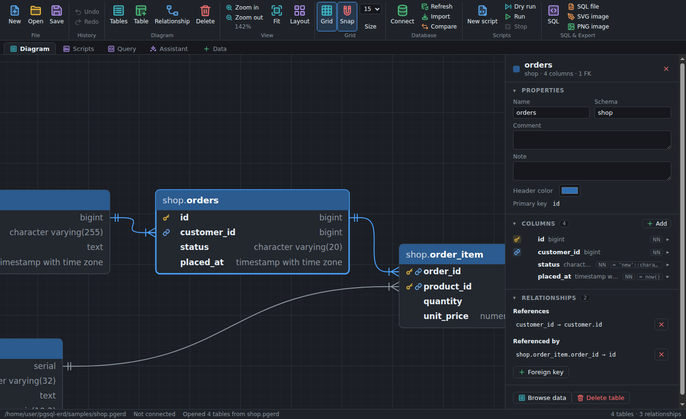
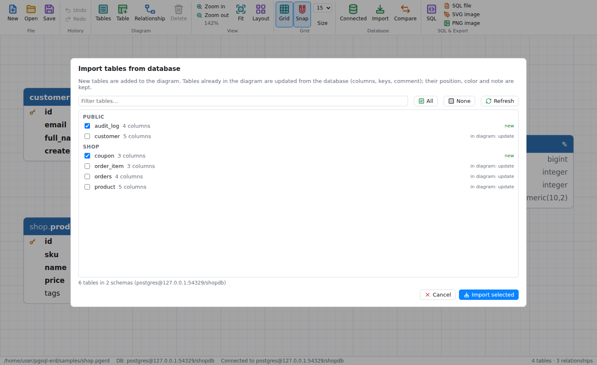
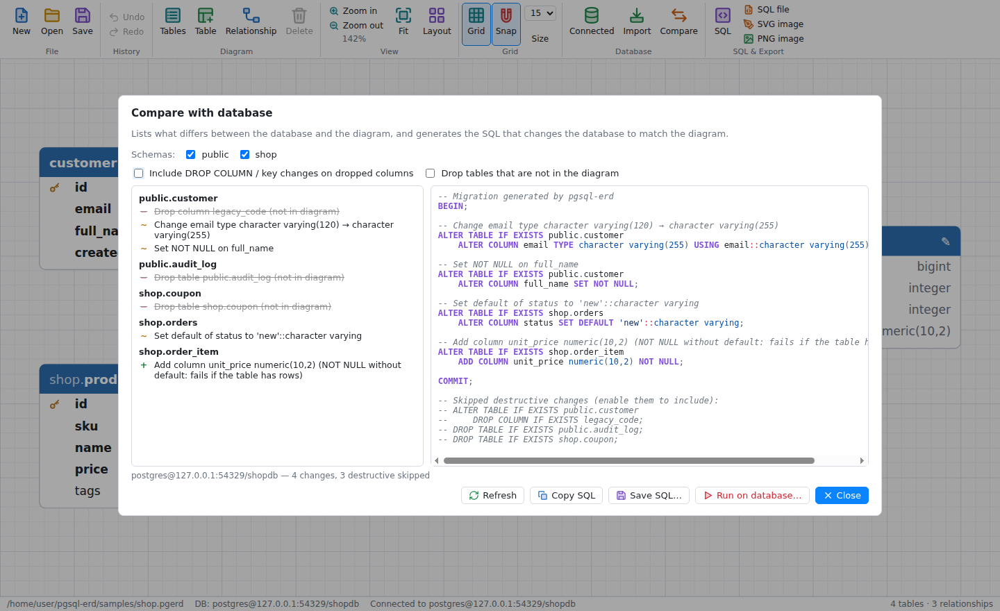

# pgsql-erd

A desktop ERD (entity–relationship diagram) tool for PostgreSQL, built with Node.js and Electron.
It opens and saves **pgAdmin 4 `.pgerd` files**, so diagrams can move back and forth between
pgAdmin's ERD tool and this app.



## Screenshots

| | |
|---|---|
| **Table sidebar:** select a table to see and edit its properties, columns and relationships. Clicking a column in the diagram opens its editor. | **SQL preview:** live PostgreSQL DDL with syntax highlighting. |
|  |  |
| **Relationships:** add a foreign key, optionally creating the column. | **Dark theme:** follows the system setting. |
|  |  |
| **Import from database:** pick tables to add, or refresh the ones already in the diagram. | **Compare / sync:** differences with the database and the migration SQL. |
|  |  |

## Features

- Open `.pgerd` files from **File → Open**, by dragging them onto the window, from the command
  line (`npm start -- path/to/file.pgerd`), or by double-clicking them once the app is installed
  (the packaged app registers the `.pgerd` file type).
- Draws tables with columns, types, primary keys (PK) and foreign keys (FK). Relationships use
  crow's-foot notation.
- A sidebar opens when you select a table. It shows:
  - the table's name, schema and column count
  - its properties (name, schema, comment, note, header colour, primary key)
  - its columns, with PK/FK, NOT NULL and default markers; click one to edit it
  - its relationships, in both directions

  Click a column in the diagram to jump to it. Drag the sidebar's edge to resize it, and press
  <kbd>Esc</kbd> or × to close it. **Tables** in the toolbar shows a filterable list of all tables.
- Editing:
  - add, rename and delete tables
  - edit columns: name, type, length/scale, NOT NULL, PK, default value, order
  - set schema, comment, note and header colour
  - add and remove relationships, optionally creating the FK column for you
- Drag tables to move them. Drag the background to pan, scroll to zoom, and use **Fit** or
  **Auto layout** to tidy up.
- A grid is drawn behind the diagram (**Grid**, <kbd>Ctrl</kbd>+<kbd>Alt</kbd>+<kbd>G</kbd>), with a
  heavier line every fifth cell. With **Snap** on (<kbd>Ctrl</kbd>+<kbd>Shift</kbd>+<kbd>G</kbd>),
  dragged tables, arrow-key nudges, new tables and auto layout all land on grid lines; hold
  <kbd>Alt</kbd> while dragging to invert snapping for that move, and <kbd>Shift</kbd>+arrow nudges
  by 1px. The grid size is picked next to the Snap button and saved in the file's `gridSize`.
- Undo/redo, and a prompt about unsaved changes when you close the window.
- Save back to `.pgerd`. Properties this app doesn't edit (tablespace, check constraints, and so
  on) are kept as they were.
- Live SQL preview with syntax highlighting, and export to PostgreSQL DDL (`CREATE TABLE`, primary keys, unique
  constraints, foreign keys, comments), SVG or PNG.
- Follows the system's light or dark theme.

## Database sync

The **Database** menu (and the *Connect DB / Import / Compare / Sync* toolbar buttons) works with a live
PostgreSQL 10+ server:

- **Connect:** host, port, database, user, password and SSL mode. The password stays in memory for the
  window; the other settings are remembered.
- **Import tables:** lists every table in the database by schema, with its column count and whether it's
  already in the diagram. Selected tables that are new are added to the diagram with their columns, primary
  keys, unique constraints and foreign keys. Tables already in the diagram are updated from the database;
  their position, colour and note are kept. Serial columns come back as `serial`/`bigserial`.
- **Compare / Sync:** compares the diagram with the database (per schema) and lists every difference:
  - new and dropped tables and columns
  - type, `NOT NULL`, default and identity changes
  - primary keys, unique constraints and foreign keys (including `ON DELETE`/`ON UPDATE` changes)
  - table comments

  It then generates the migration SQL that makes the database match the diagram. You can copy or save it,
  or run it on the database in a single transaction; if any statement fails, nothing is applied.
  - Statements are ordered so they work: dependent foreign keys are dropped before a key they reference and
    re-created afterwards.
  - Destructive statements (`DROP COLUMN`, `DROP TABLE`) are only included when you tick the matching
    option. Otherwise they appear as comments at the end of the script.
  - Renamed tables or columns can't be detected: they show up as a drop plus an add.

## Getting started

```bash
npm install
npm start                          # empty diagram
npm start -- samples/shop.pgerd    # open a file
npm test                           # unit tests
# integration tests against a real server (creates and drops a temporary database):
PGERD_TEST_HOST=127.0.0.1 PGERD_TEST_PORT=5432 PGERD_TEST_USER=postgres npm test
```

To build installers (AppImage/deb, NSIS, dmg) with the `.pgerd` file association:

```bash
npm run dist
```

### Windows (.exe)

On Windows, with Node.js 20+ installed, run from the repository root:

```bat
scripts\build-windows.bat
```

It is a plain batch file, so it runs from Command Prompt or by double-clicking, without changing the
PowerShell execution policy.

This installs dependencies, runs the tests and writes to `dist\`:

| File | What it is |
| --- | --- |
| `pgsql-erd-Setup-<version>.exe` | Installer: choose the install folder, adds Start menu and desktop shortcuts, registers `.pgerd` files |
| `pgsql-erd-<version>-portable.exe` | Single executable that runs without installing |
| `win-unpacked\pgsql-erd.exe` | The unpacked app the other two are made from |

To build only one target, pass `installer`, `portable` or `dir` (default `all`), e.g.
`scripts\build-windows.bat portable`. Options: `--skip-tests`, `--skip-install`, `--clean` (delete
`dist\` first). The same builds are available as npm scripts:
`npm run dist:win` (installer + portable), `dist:win:installer`, `dist:win:portable` and `dist:win:dir`.

The executables are unsigned, so Windows SmartScreen warns the first time they run. Building them on
Linux or macOS also works but needs [Wine](https://www.winehq.org/) (with 32-bit support for the
installer).

## Project layout

```
src/main/main.cjs         Electron main process: windows, menus, file dialogs, file I/O
src/main/db.cjs           PostgreSQL connection, catalog introspection, migration execution (pg)
src/main/preload.cjs      contextBridge API exposed to the renderer (window.erdHost)
src/renderer/index.html   UI shell
src/renderer/app.js       rendering, interaction, properties panel, commands
src/renderer/dbui.js      connect / import / compare dialogs
src/renderer/lib/pgerd.js .pgerd parsing and serialization
src/renderer/lib/sql.js   PostgreSQL DDL generation
src/renderer/lib/layout.js table geometry, relationship routing, auto layout
src/renderer/lib/catalog.js catalog rows -> diagram model
src/renderer/lib/diff.js  database vs diagram comparison and migration SQL
src/renderer/lib/sync.js  import / update diagram tables from the database
src/renderer/lib/highlight.js SQL syntax highlighting
samples/shop.pgerd        example diagram
tests/                    node:test suites
```

The renderer runs sandboxed with context isolation and no Node integration. All file access goes
through the preload bridge.

## The .pgerd format

A `.pgerd` file is pgAdmin's serialized react-diagrams model:

```json
{
  "version": 80900,
  "data": {
    "offsetX": 0, "offsetY": 0, "zoom": 100, "gridSize": 15,
    "layers": [
      { "type": "diagram-links", "models": { "<link id>": { "data": {
          "local_table_uuid": "…", "local_column_attnum": 1,
          "referenced_table_uuid": "…", "referenced_column_attnum": 0 } } } },
      { "type": "diagram-nodes", "models": { "<table id>": {
          "type": "table", "x": 40, "y": 40,
          "otherInfo": { "note": "", "data": {
            "name": "orders", "schema": "public",
            "columns": [{ "name": "id", "cltype": "bigint", "attnum": 0, "is_primary_key": true }],
            "primary_key": [{ "columns": [{ "column": "id" }] }],
            "foreign_key": [{ "name": "…", "columns": [{ "local_column": "customer_id",
              "references": "<table id>", "referenced": "id" }] }] } } } } }
    ]
  }
}
```

The app reads relationships from each table's `foreign_key` list and from the links layer. When
saving, it rebuilds both, together with the ports pgAdmin uses to attach links to columns.
