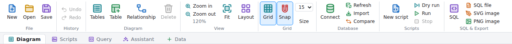
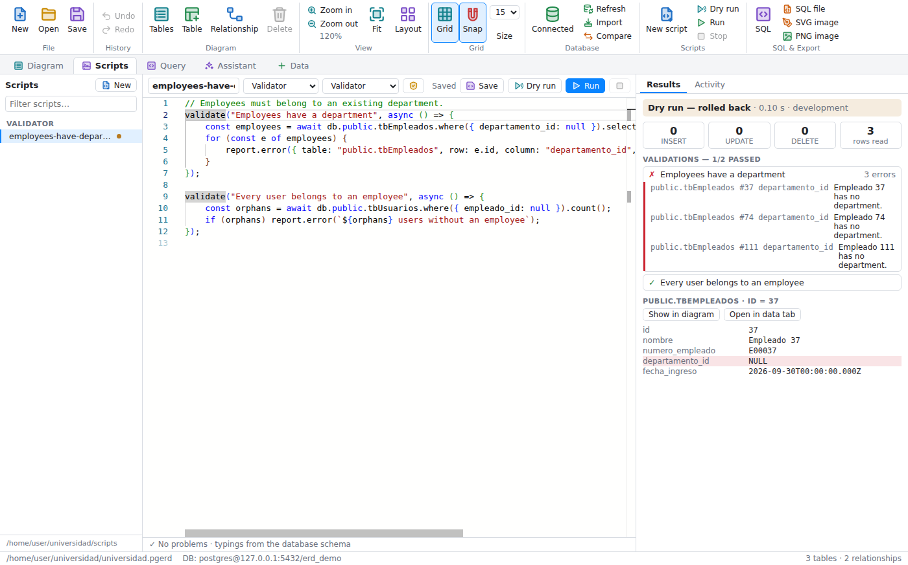
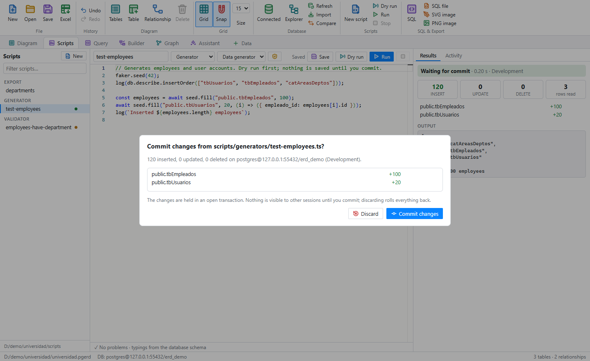
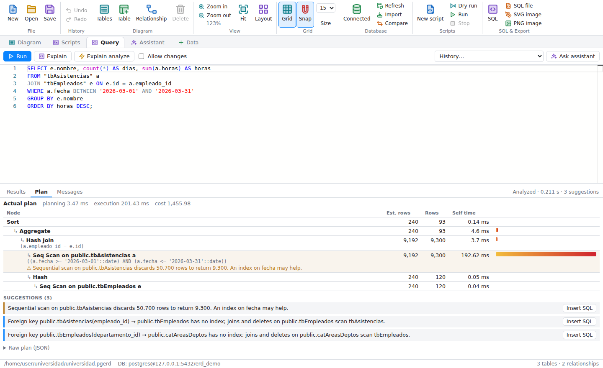
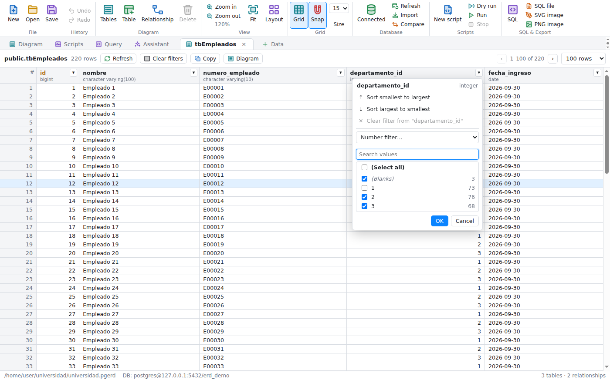
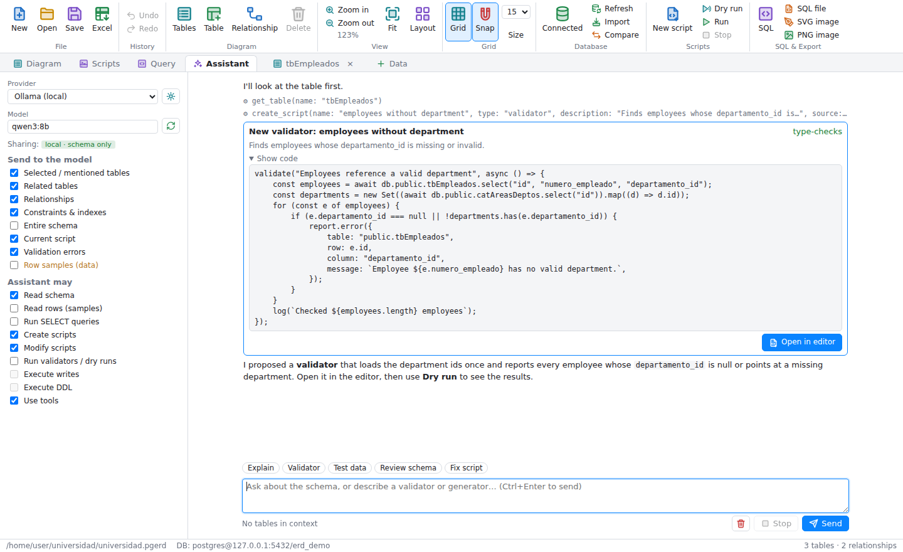
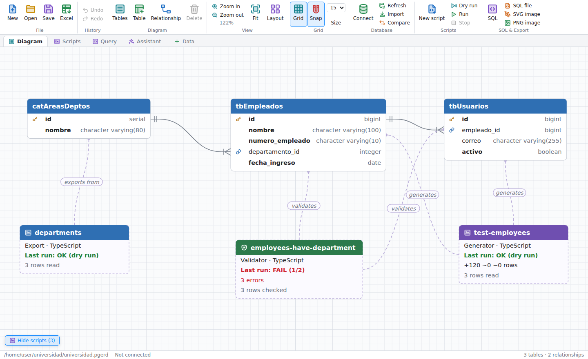

# pgsql-erd

A desktop ERD (entity–relationship diagram) tool and database workbench for PostgreSQL, built with
Node.js and Electron. It opens and saves **pgAdmin 4 `.pgerd` files**, so diagrams can move back and
forth between pgAdmin's ERD tool and this app, and adds schema-aware TypeScript scripts (validators,
test-data generators, migrations) with dry runs, a query analyzer, a data browser with Excel-style
filters, and an AI assistant that works with Ollama, vLLM, OpenAI and other OpenAI-compatible servers.


## Screenshots

**Ribbon and tabs:** commands are grouped Office-style (File, History, Diagram, View, Grid, Database,
Scripts, SQL & Export) with two-tone colour icons; the native menus use the same icons. Below the ribbon,
tabs switch between the **Diagram**, **Scripts**, **Query** and **Assistant**, followed by one tab per
table whose data you are browsing.



| | |
|---|---|
| **Table sidebar:** select a table to see and edit its properties, columns and relationships. Clicking a column in the diagram opens its editor. | **SQL preview:** live PostgreSQL DDL with syntax highlighting. |
|  |  |
| **Relationships:** add a foreign key, optionally creating the column. | **Dark theme:** follows the system setting. |
|  |  |
| **Import from database:** pick tables to add, or refresh the ones already in the diagram. | **Compare / sync:** differences with the database and the migration SQL. |
|  |  |
| **Scripts:** typed TypeScript validators; clicking an error shows the row. | **Commit review:** a run's changes wait in an open transaction until you commit. |
|  |  |
| **Query analyzer:** EXPLAIN ANALYZE as a tree, with time per node and index hints. | **Data tabs:** Excel-style filters with value lists, blanks and conditions. |
|  |  |
| **Assistant:** proposes scripts that open unsaved for review; they type-check against the schema. | **Scripts in the diagram:** each script linked to the tables it uses, with its last run. |
|  |  |

## Features

- Open `.pgerd` files from **File → Open**, by dragging them onto the window, from the command
  line (`npm start -- path/to/file.pgerd`), or by double-clicking them once the app is installed
  (the packaged app registers the `.pgerd` file type).
- Draws tables with columns, types, primary keys (key icon) and foreign keys (link icon). Relationships use
  crow's-foot notation.
- A sidebar opens when you select a table. It shows:
  - the table's name, schema and column count
  - its properties (name, schema, comment, note, header colour, primary key)
  - its columns, with PK/FK icons and NOT NULL and default markers; click one to edit it
  - its relationships, in both directions

  Click a column in the diagram to jump to it. Drag the sidebar's edge to resize it, and press
  <kbd>Esc</kbd> or × to close it. **Tables** in the ribbon shows a filterable list of all tables.
- Editing:
  - add, rename and delete tables
  - edit columns: name, type, length/scale, NOT NULL, PK, default value, order
  - set schema, comment, note and header colour
  - add and remove relationships, optionally creating the FK column for you
- Drag tables to move them. Drag the background to pan, scroll to zoom, and use **Fit** or
  **Auto layout** to tidy up.
- A grid is drawn behind the diagram (**Grid**, <kbd>Ctrl</kbd>+<kbd>Alt</kbd>+<kbd>G</kbd>), with a
  heavier line every fifth cell. With **Snap** on (<kbd>Ctrl</kbd>+<kbd>Shift</kbd>+<kbd>G</kbd>),
  dragged tables, arrow-key nudges, new tables and auto layout all land on grid lines; hold
  <kbd>Alt</kbd> while dragging to invert snapping for that move, and <kbd>Shift</kbd>+arrow nudges
  by 1px. The grid size is picked with **Size**, next to the Snap button and saved in the file's `gridSize`.
- Undo/redo, and a prompt about unsaved changes when you close the window.
- Save back to `.pgerd`. Properties this app doesn't edit (tablespace, check constraints, and so
  on) are kept as they were.
- Import tables from **Excel (`.xlsx`/`.xlsm`) or CSV** with **File → Import from Excel / CSV**
  (<kbd>Ctrl</kbd>+<kbd>Alt</kbd>+<kbd>E</kbd>), the **Excel** ribbon button, or by dropping the file on the window.
  Each sheet is read in one of two layouts:
  - **Column definitions:** a header row with *Column* and *Type* (plus any of *Table, Schema, Length, Scale,
    Nullable / Not null, PK, Unique, Default, References, Comment*), one row per column. A *Table* column splits
    the sheet into several tables (a blank cell continues the table above); *References* takes `table.column`,
    `schema.table.column` or `table(column)` and becomes a foreign key. Common type spellings (`varchar(50)`,
    `int`, `decimal(10,2)`, `datetime`, …) are mapped to PostgreSQL types. English and Spanish headers are recognised.
  - **Data:** the first row names the columns and the rows below are data. Types (integer, bigint, numeric,
    boolean, date, timestamp, time, uuid, jsonb, text) are inferred from the values, and an `id` column with
    unique values becomes the primary key.

  The dialog lets you pick and rename the tables, set the schema and preview the SQL. Names are converted to
  snake_case unless you turn that off. Tables already in the diagram are updated and keep their position.
  Old `.xls` files are not supported; save them as `.xlsx` first.
- Live SQL preview with syntax highlighting, and export to PostgreSQL DDL (`CREATE TABLE`, primary keys, unique
  constraints, foreign keys, comments), SVG or PNG.
- An Office-style ribbon with labelled command groups and two-tone colour icons, which the
  native menus and dialogs share.
- Follows the system's light or dark theme.

## Database sync

The **Database** menu (and the *Connect / Import / Compare* buttons in the ribbon) works with a live
PostgreSQL 10+ server:

- **Connect:** host, port, database, user, password and SSL mode. The password stays in memory for the
  window; the other settings are remembered.
- **Import tables:** lists every table in the database by schema, with its column count and whether it's
  already in the diagram. Selected tables that are new are added to the diagram with their columns, primary
  keys, unique constraints and foreign keys. Tables already in the diagram are updated from the database;
  their position, colour and note are kept. Serial columns come back as `serial`/`bigserial`.
- **Compare / Sync:** compares the diagram with the database (per schema) and lists every difference:
  - new and dropped tables and columns
  - type, `NOT NULL`, default and identity changes
  - primary keys, unique constraints and foreign keys (including `ON DELETE`/`ON UPDATE` changes)
  - table comments

  It then generates the migration SQL that makes the database match the diagram. You can copy or save it,
  or run it on the database in a single transaction; if any statement fails, nothing is applied.
  - Statements are ordered so they work: dependent foreign keys are dropped before a key they reference and
    re-created afterwards.
  - Destructive statements (`DROP COLUMN`, `DROP TABLE`) are only included when you tick the matching
    option. Otherwise they appear as comments at the end of the script.
  - Renamed tables or columns can't be detected: they show up as a drop plus an add.

## Workbench tabs

### Scripts

Scripts are TypeScript files kept next to the diagram, in `scripts/<type>/` (validators, generators,
seeders, migrations, queries, maintenance, imports, exports), so they can live in version control. The
first line holds their metadata (`// @pgsql-erd {"type":"validator"}`).

- **Monaco editor with IntelliSense for your database.** Typings are generated from the connected
  database (or from the diagram when offline): each table gets a row and an insert interface, and
  `db.public.tbUsuarios.insert({ nombre: 123 })` is reported as *Type 'number' is not assignable to type
  'string'*. Unknown table names in `db.table("…")` are flagged too. The typings are also written to
  `generated/database.d.ts` for other editors. Typings refresh on **Database → Refresh Schema**.
- **Script API** (globals, no imports):
  - `db.public.orders.where({ status: ["new", "paid"], total: { gt: 10 } }).orderBy("id").limit(50).select()`,
    `.first()`, `.count()`, `.insert(row)`, `.insertMany(rows)`, `.update(values)`, `.delete()`
  - `db.query(sql, params)`, `db.transaction(async (tx) => …)` (a savepoint),
    `db.describe.table() / relationships() / insertOrder()`, `db.preview()`
  - `validate(name, async () => { report.error({ table, row, column, message }) })`, `report.warning/info`, `log()`
  - `faker` (seeded fake data), `seed.row(table)`, `seed.fill(table, n)` (plausible values, valid foreign keys,
    unique values that don't collide with existing rows), `seed.check(table, row)`
  - `ai.chat(prompt)`, `ai.structured({ table | schema, prompt })` (validated JSON, see below)
- **Dry run** (F6) runs the script in a transaction that is always rolled back and reports inserts, updates,
  deletes and rows read per table. **Run** (F5) keeps the transaction open when the script changed data and
  asks you to commit or discard (rolled back automatically after 10 minutes).
- **Permissions** per script, from profiles (Read only, Validator, Data generator, Seeder, Migration, Full
  access) plus overrides: read rows, raw SELECT, INSERT, UPDATE, DELETE, DDL, raw SQL writes, AI. Scripts
  without write permissions run in a `READ ONLY` transaction, so PostgreSQL enforces it as well.
- **Validators** list each `validate()` with pass/fail; clicking an error shows the offending row, the
  validation in the editor, and links to the table in the diagram and in a data tab.

### Scripts in the diagram

**Show scripts** (bottom left of the diagram, or **View → Show Scripts in Diagram**) draws the project's saved
scripts as entities next to the tables they use. A script is linked to the tables named in its source or listed in
its metadata, with a dashed line labelled by what it does: *validates*, *generates*, *seeds*, *migrates*,
*imports into*, *exports from*, *queries*. Each box shows the script's type and its last run on this machine: PASS or
FAIL with the number of validations, rows changed, rows checked.

- Drag boxes to arrange them; their positions are saved in `pgsql-erd.json`, not in the `.pgerd` file, so the
  diagram stays compatible with pgAdmin. Exported SVG and PNG images include the scripts while they are shown.
- Click a box for its details and linked tables, with **Open script** and **Run validator** / **Dry run**;
  double-click opens it in the Scripts tab.
- A table's sidebar lists the scripts that use it, with their last result.
- Scripts are hidden by default, to keep large diagrams readable.

### Query

A SQL editor with table and column completion. **Run** (Ctrl+Enter) runs the selection or everything in a
read-only transaction; statements that change data or the schema need **Allow changes**, a confirmation,
and a connection that allows writes, and are committed together. **Explain** shows the estimated plan and
**Explain analyze** (Ctrl+Shift+Enter) the actual one (always rolled back), as a tree with rows, self time
and a bar per node. Hints point out sequential scans that discard most rows, bad row estimates, sorts and
hashes that spill to disk and foreign keys without an index, with the `CREATE INDEX` / `ANALYZE` statement
to insert. **Ask assistant** sends the query, its plan and the hints to the Assistant tab.

### Data tabs

**Data** in the tab bar (or **Browse data** in a table's sidebar, or **Database → Browse Table Data…**)
opens a table in its own tab: a read-only grid with paging (100/500/1000 rows), sticky headers and **Copy**
(tab-separated, pastes into a spreadsheet). Each column header has an Excel-style filter menu:

- sort ascending / descending (by the column's type: numbers and dates sort as such)
- a checklist of the column's distinct values with their counts, **(Blanks)**, **(Select all)** and a search box;
  as in Excel, the list reflects the other columns' filters
- text filters (contains, begins with, equals, is empty, …) or number / date filters (greater than, between, …)

Active filters show as chips above the grid.

### Assistant

Chat with a model about the schema, and let it write scripts. It sees the tables selected in the diagram
or named in the question, their related tables, relationships and constraints, the current script and
the last validation errors — each can be switched off. With tools enabled it can look up tables, check a
script against the typings, validate SQL, and propose new scripts or changes; proposals open **unsaved**
in the editor, labelled with whether they type-check. Nothing the assistant writes runs by itself.

- **Providers:** Ollama, vLLM / LM Studio / llama.cpp / any OpenAI-compatible server, and OpenAI. Configure
  them in **AI setup**; the model list comes from the server. API keys are stored encrypted with the
  operating system's credential store (Electron `safeStorage`: Keychain, DPAPI, libsecret) and never reach the
  window; without a credential store they are kept in memory only. `OPENAI_API_KEY` is used when set.
- **Permissions** (saved in the project): read schema, read rows, run SELECT, create/modify scripts, run
  validators and dry runs. Writes and DDL are never available to the assistant.
- **Row data** is only sent when allowed (samples, query results, validator output); for remote providers
  you confirm it first, and the panel shows whether the conversation is *schema only* or includes data.
- **Structured output** (`ai.structured`) asks for JSON matching a JSON Schema (for a table, derived from
  its insertable columns), then checks JSON parsing, the schema, column types, NOT NULL and lengths, and sends
  the errors back to the model for a retry. Only valid values are returned to the script.

## Safety model

- The page (renderer) never runs scripts or sees credentials: the database password is sent once when
  connecting and stays in the main process; API keys likewise.
- Scripts run in a separate process (Electron's Node) with an empty environment, a memory limit, a
  timeout and Node's permission model: no file writes, no reads outside the app, no child processes. The
  process holds no database connection; every `db.*` call goes to the main process, which checks the
  script's permissions and the connection's policy.
- Connections have an environment (development, testing, staging, production) and a policy: production
  is read-only by default, shown in red, and blocks DDL including migrations from the compare dialog.
- Writes are reviewed before they are committed; `BEGIN`/`COMMIT` inside scripts are refused.
- An audit log (**Database → Open Audit Log**, and the Activity tab) records connections, schema refreshes
  and migrations, script runs and commits, query-tab writes, assistant requests (and whether they carried
  row data) and settings changes.

## Getting started

```bash
npm install
npm start                          # empty diagram
npm start -- samples/shop.pgerd    # open a file
npm test                           # unit tests
# integration tests against a real server (creates and drops temporary databases):
PGERD_TEST_HOST=127.0.0.1 PGERD_TEST_PORT=5432 PGERD_TEST_USER=postgres PGERD_TEST_PASSWORD=… npm test
```

Icons live in `src/renderer/icons.js`. After changing them, run `npm run menu-icons` to re-render
the PNG icons of the native menus into `src/main/menu-icons/`.

To build installers (AppImage/deb, NSIS, dmg) with the `.pgerd` file association:

```bash
npm run dist
```

### Windows (.exe)

On Windows, with Node.js 20+ installed, run from the repository root:

```bat
scripts\build-windows.bat
```

It is a plain batch file, so it runs from Command Prompt or by double-clicking, without changing the
PowerShell execution policy.

This installs dependencies, runs the tests and writes to `dist\`:

| File | What it is |
| --- | --- |
| `pgsql-erd-Setup-<version>.exe` | Installer: choose the install folder, adds Start menu and desktop shortcuts, registers `.pgerd` files |
| `pgsql-erd-<version>-portable.exe` | Single executable that runs without installing |
| `win-unpacked\pgsql-erd.exe` | The unpacked app the other two are made from |

To build only one target, pass `installer`, `portable` or `dir` (default `all`), e.g.
`scripts\build-windows.bat portable`. Options: `--skip-tests`, `--skip-install`, `--clean` (delete
`dist\` first). The same builds are available as npm scripts:
`npm run dist:win` (installer + portable), `dist:win:installer`, `dist:win:portable` and `dist:win:dir`.

The app, installer and uninstaller use `build/icon.ico`. The executables are unsigned, so Windows SmartScreen warns the first time they run. Building them on
Linux or macOS also works but needs [Wine](https://www.winehq.org/) (with 32-bit support for the
installer).

## Project layout

```
src/main/main.cjs         Electron main process: windows, menus, file dialogs, file I/O
src/main/db.cjs           PostgreSQL connection, catalog introspection, migration execution (pg)
src/main/preload.cjs      contextBridge API exposed to the renderer (window.erdHost)
src/main/ipc/             IPC for connections, scripts, queries, data tabs, the assistant, the audit log
src/main/database/        per-window connections and policies, query tab runner, data browser queries
src/main/scripting/       type checking and transpiling (TypeScript), script runs, the script-side database API
src/main/ai/              providers (Ollama, OpenAI-compatible, OpenAI), keys, tools, structured output
src/main/projects/        scripts and settings in the project folder
src/runner/               the isolated script process
src/shared/               schema model, typings generator, permissions, context builder, JSON schema,
                          fake data, plan analyzer (used by the main process, the runner and the page)
src/renderer/index.html   UI shell
src/renderer/app.js       rendering, interaction, properties panel, commands
src/renderer/dbui.js      connect / import / compare dialogs
src/renderer/tabs.js      main tabs
src/renderer/workbench.js Scripts tab
src/renderer/query.js     Query tab
src/renderer/databrowser.js data tabs and filters
src/renderer/assistant.js Assistant tab and AI provider settings
src/renderer/xlui.js      Excel / CSV import dialog
src/renderer/lib/pgerd.js .pgerd parsing and serialization
src/renderer/lib/sql.js   PostgreSQL DDL generation
src/renderer/lib/layout.js table geometry, relationship routing, auto layout
src/renderer/lib/catalog.js catalog rows -> diagram model
src/renderer/lib/diff.js  database vs diagram comparison and migration SQL
src/renderer/lib/sync.js  import / update diagram tables from the database
src/renderer/lib/spreadsheet.js .xlsx / CSV reading and sheet -> table conversion
src/renderer/lib/highlight.js SQL syntax highlighting
samples/shop.pgerd        example diagram
build/icon.svg            app icon source; icon.ico (Windows) and icon.png are rendered from it
scripts/build-windows.bat Windows build script
tests/                    node:test suites
```

The renderer runs sandboxed with context isolation and no Node integration. All file access goes
through the preload bridge.

A project folder looks like this; everything is plain text, and no passwords or API keys are stored in it:

```
project/
├── diagram.pgerd
├── pgsql-erd.json            project settings (assistant provider, model, permissions)
├── scripts/
│   ├── validators/*.ts
│   ├── generators/*.ts
│   └── migrations/*.ts
└── generated/database.d.ts   typings for other editors
```

## The .pgerd format

A `.pgerd` file is pgAdmin's serialized react-diagrams model:

```json
{
  "version": 80900,
  "data": {
    "offsetX": 0, "offsetY": 0, "zoom": 100, "gridSize": 15,
    "layers": [
      { "type": "diagram-links", "models": { "<link id>": { "data": {
          "local_table_uuid": "…", "local_column_attnum": 1,
          "referenced_table_uuid": "…", "referenced_column_attnum": 0 } } } },
      { "type": "diagram-nodes", "models": { "<table id>": {
          "type": "table", "x": 40, "y": 40,
          "otherInfo": { "note": "", "data": {
            "name": "orders", "schema": "public",
            "columns": [{ "name": "id", "cltype": "bigint", "attnum": 0, "is_primary_key": true }],
            "primary_key": [{ "columns": [{ "column": "id" }] }],
            "foreign_key": [{ "name": "…", "columns": [{ "local_column": "customer_id",
              "references": "<table id>", "referenced": "id" }] }] } } } } }
    ]
  }
}
```

The app reads relationships from each table's `foreign_key` list and from the links layer. When
saving, it rebuilds both, together with the ports pgAdmin uses to attach links to columns.
